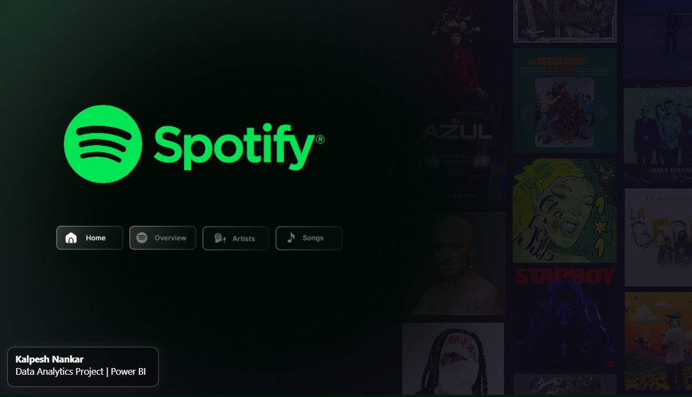
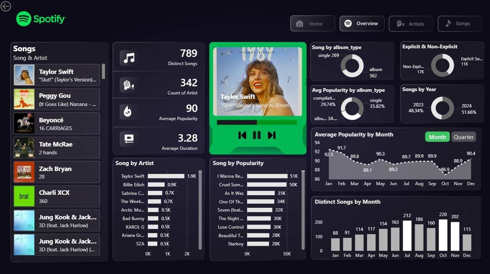
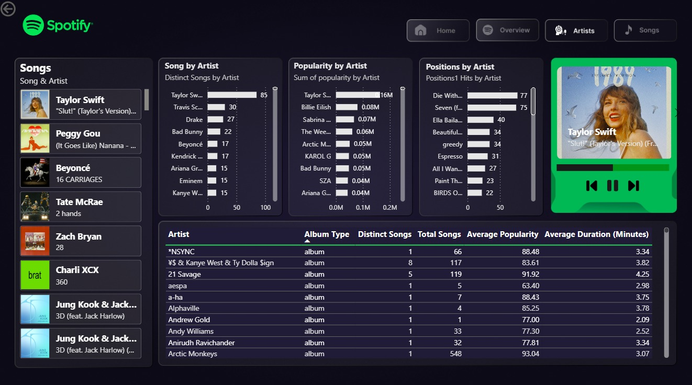
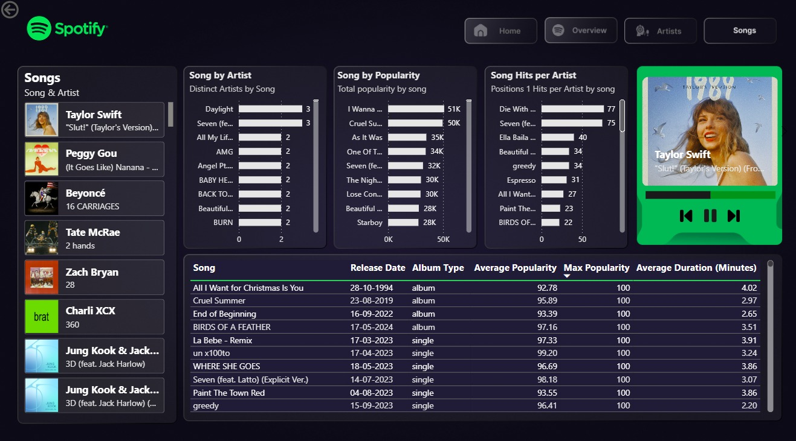

# 🎵 Spotify Top 50 World — Power BI Dashboard

> 📊 Interactive Power BI dashboard analyzing Spotify Top 50 World data to uncover trends in songs, artists, popularity, and streaming performance.

---

## 📌 Project Overview

This project analyzes **Spotify Top 50 World dataset** covering global chart performance.

It provides insights into:
- 🎤 Artist performance
- 🎵 Song popularity trends
- 📅 Monthly listening behavior
- 📊 Distribution of songs across album types
- 🔥 Explicit vs Non-explicit content trends

---

## 🖼️ Dashboard Screenshots

### 🏠 Home

  

### 📊 Overview

  

### 🎤 Artists

  

### 🎵 Songs

  

---

## 📊 Key KPIs

| KPI | Value |
|-----|-------|
| 🎵 Total Songs | 789 |
| 🎤 Total Artists | 342 |
| ⭐ Avg Popularity | 90 |
| ⏱️ Avg Duration | 3.28 min |
| 📅 Data Coverage | 2023–2024 |

---

## 📋 Dashboard Features

### 🏠 Home
- Navigation panel for all report pages
- Spotify-themed UI design

### 📊 Overview
- KPI Cards (Songs, Artists, Popularity, Duration)
- Songs by Artist (Top performers)
- Popularity trend by Month
- Album Type distribution (Album / Single)
- Explicit vs Non-explicit breakdown
- Year-wise song distribution

### 🎤 Artists
- Songs by Artist ranking
- Total popularity by artist
- #1 chart hits per artist
- Detailed artist table (songs, popularity, duration)
- 🎵 “Now Playing” dynamic card

### 🎵 Songs
- Song-level popularity analysis
- Multi-artist collaborations
- Song hits per artist
- Detailed songs table (release date, album type)
- Interactive filtering across visuals

---

## 🏆 Key Insights

- 🎤 **Taylor Swift** dominates with highest songs & popularity
- 📅 **2024 songs** slightly higher than 2023 releases
- 🎵 **Albums** dominate over singles in chart presence
- 🔞 **Non-explicit songs** are more common than explicit
- 📈 Popularity peaks in **January**
- 🥇 *“Die With A Smile”* has the most #1 chart positions

---

## 🛠️ Tools & Technologies

| Tool | Purpose |
|------|--------|
| Power BI Desktop | Dashboard creation |
| Power Query | Data cleaning |
| DAX | Measures & KPIs |
| CSV Dataset | Data source |

---

## 🤝 Contributions

Contributions are welcome! Feel free to open issues or pull requests to improve the dashboard or add new insights.

---

## ⭐ Support

If you found this project helpful, please ⭐ star the repository!

---

## 👤 Author

**Kalpesh Nankar**
📧 nankarkalpesh290@gmail.com
